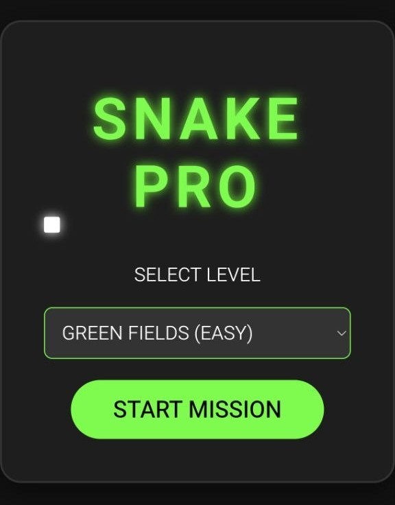
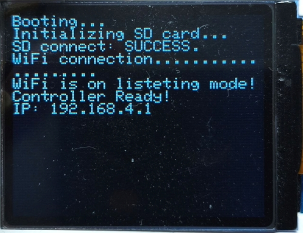
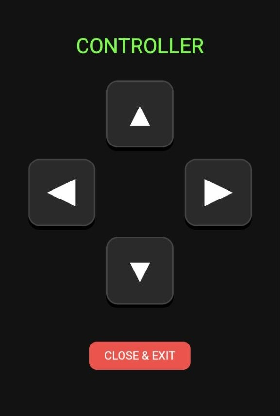
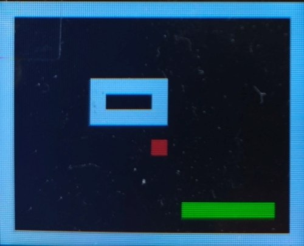

# 🐍 Snake Pro - IoT Hardware Game

Snake Pro is a modern, IoT-enabled take on the classic arcade game, built on the **Arduino Nano RP2040 Connect**. Instead of using physical buttons, the game hosts its own WiFi network and captive portal, allowing users to control the game via a custom web-app interface served directly to their smartphones.

## ✨ Key Features

* **Wireless Smartphone Controller:** The RP2040 acts as a Web Server and WiFi Access Point. Players connect to the network and are served an HTML/JS/CSS digital D-Pad controller.
* **Captive Portal DNS Intercept:** Implements custom UDP DNS logic to automatically route any web request on the local network to the game's controller page.
* **Dynamic Level Loading via SD:** Game maps are parsed from `.txt` files stored on an external SD card, allowing for modular map design without flashing the board.
* **Non-Blocking Audio & Graphics:** Utilizes an Adafruit ST7735 TFT display and a passive buzzer. Game logic runs asynchronously, ensuring screen updates and PWM audio do not halt the server network requests.

## 📸 Gallery
| Smartphone Controller | HardWare Screen |
| :---: | :---: |
|  |  |
|  |  |

  <video src="https://github.com/IgoryanDeltoro/ArduinoSnakePro/blob/main/media/video.mp4" width="100%" autoplay loop muted playsinline></video>

## 🛠️ Hardware Requirements (BoM)

| Component | Description |
| :--- | :--- |
| **Microcontroller** | Arduino Nano RP2040 Connect |
| **Display** | 1.8" SPI TFT Display (ST7735) |
| **Storage** | MicroSD Card Module (SPI) + MicroSD Card (FAT32) |
| **Audio** | Passive Piezo Buzzer (with 100Ω resistor) |

### Pin Mapping / Wiring Diagram

Both the TFT display and the SD Card module share the SPI bus. Chip Select (CS) pins are strictly managed in software to prevent data collisions.

| RP2040 Pin | TFT Display | SD Card Module | Buzzer |
| :--- | :--- | :--- | :--- |
| **3V3** | VCC | VCC | - |
| **GND** | GND | GND | GND |
| **D13 (SCK)** | SCL / SCK | SCK | - |
| **D11 (MOSI)**| SDA / MOSI | MOSI | - |
| **D12 (MISO)**| - | MISO | - |
| **D10 (CS)** | CS | - | - |
| **D8 (DC)** | DC / A0 | - | - |
| **D9 (RST)** | RES / RST | - | - |
| **D4 (CS)** | - | CS | - |
| **D3 (PWM)** | - | - | Positive Lead |

## 💻 Software Dependencies

Make sure the following libraries are installed via the Arduino IDE Library Manager:
* `SPI` & `SD` (Standard Arduino Libraries)
* `Adafruit GFX Library`
* `Adafruit ST7735 and ST7789 Library`
* `WiFiNINA_Generic` (For NINA module networking)
* `WiFiWebServer` & `WiFiUdp_Generic`

## 🚀 Installation & Setup

1.  **Format the SD Card:** Format a MicroSD card to **FAT32**. Create a folder named `maps` in the root directory.
2.  **Create Levels:** Inside the `maps` folder, create files named `level1.txt`, `level2.txt`, etc. 
    * *Formatting:* Use `0` for empty space, `1` for walls, `S` for the snake start position, and `F` for food.
3.  **Flash the Board:** Open `main.ino` in the Arduino IDE, select the *Arduino Nano RP2040 Connect* board profile, and upload.
4.  **Play:** * Look for the WiFi network **"Snake_Pro_Network"** on your smartphone.
    * Connect using the password `12345678`.
    * Open your browser and navigate to any web page (or `192.168.4.1`). The captive portal will serve the controller UI.

## 🧠 Architecture Notes

To handle simultaneous network routing and frame rendering, the main `loop()` functions as a strict state machine (`MENU`, `PLAYING`, `GAMEOVER`). Network connections (`server.handleClient()`) are checked every tick without `delay()` calls to prevent TCP pileups, while game frames are locked to a specific `speedInterval` using standard `millis()` deltas.

---
*Developed for the Arduino Nano RP2040 Connect.*
